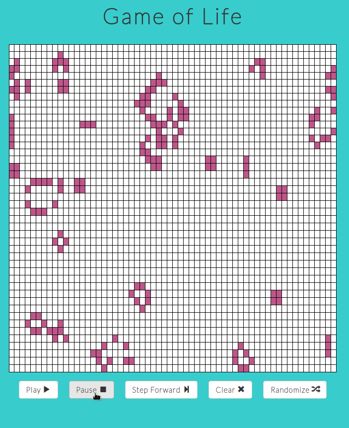

# Game of Life in JS
John Horton Conway's game of life is pseudo-simulation of life. This simple system produces complex behaviour, determining cells as alive or dead.

## Cell Regeneration Rules
* Any live cell with two or three live neighbors lives on to the next generation.
* Any live cell with fewer than two live neighbors dies, as if caused by under-population.
* Any live cell with more than three live neighbors dies, as if by overcrowding.
* Any dead cell with exactly three live neighbors becomes a live cell, as if by reproduction.

The initial pattern constitutes the seed of the system. The first generation is created by applying the above rules simultaneously to every cell in the seed — in other words, each generation is a pure function of the preceding one.

The discrete moment at which all the births and deaths actually occur is often called a tick. The rules are applied repeatedly to create further generations (one new generation per tick).

##  Project Outline
### Phase 1: Life and Death Cell Generation
- [x] Create project
- [x] Set up React with webpack
- [x] Write pure javascript backend class representing to generate board with different conditions(clear, random, or next)
- [x] Write board react component to render grid on DOM
- [x] Write cell class, which will change cell to alive or dead based on the rules

### Phase 2: Buttons
- [x] Add clear button
- [x] Add randomize button
- [x] Add play button
- [x] Add pause button
- [x] Add step button

### Phase 3: Generation Counter

- [ ] Add generation counter container and component to capture number of new generations

### Bonus Features
- [x] Add styles to make visualizations more appealing.
